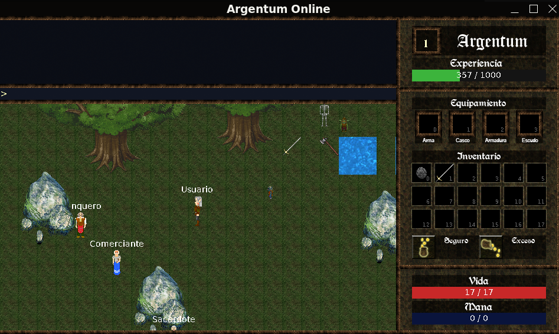
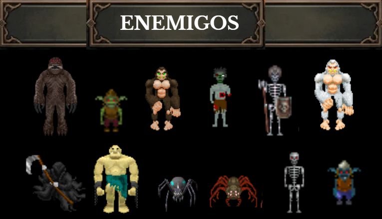
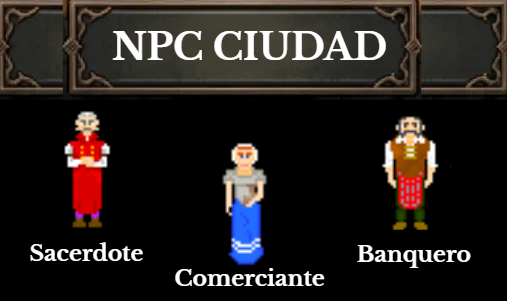
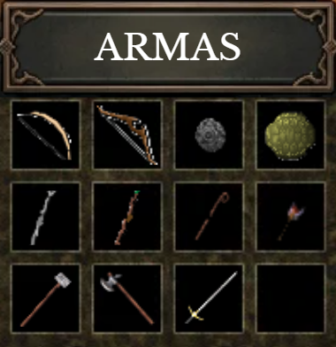
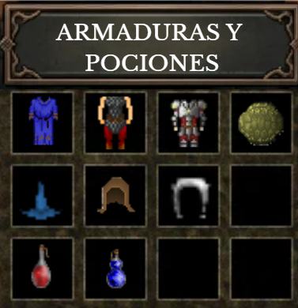
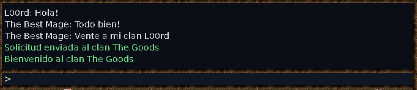
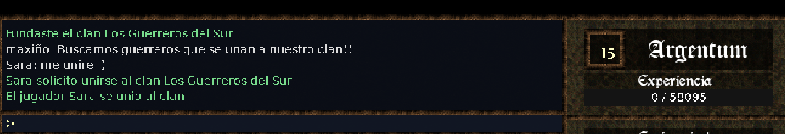
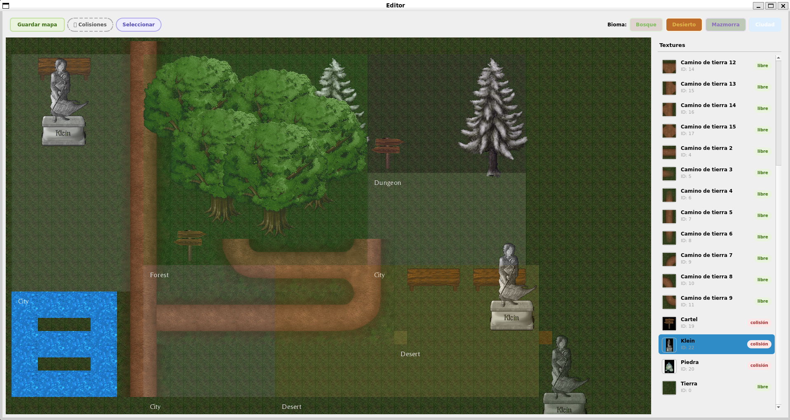

<center>

<br>
  <em>Taller de Programación I (75.42) — FIUBA</em>
</center>


## Integrantes
| Nombre                        | Padrón   |
|-------------------------------|----------|
| Thiago Reller                 | 111067   |
| Federico Tomás Parsons        | 111250   |
| Agustín Atilio Ferronato      | 111991   |
| Sara Lucia Galeano            | 112120   |


<details> <summary> <b> Para saber sobre el proceso de instalación y requisitos del sistema clic aquí</b> </summary>


## Compilación
Ubicarse en la raiz del proyecto y ejecutar:
```bash
# Instalar dependencias
./install.sh
# Configurar (solo la primera vez o si cambia CMakeLists.txt)
mkdir -p build && cmake -S . -B build/ -G Ninja
# Compilar
cmake --build build -j$(nproc)
```

## Ejecución
Moverse al **directorio de build** y ejecutar
```bash
# Editor de mapas (crear mapa nuevo de 0)
./taller_editor
# Editor de mapas (con mapa preexistente)
./taller_editor <ruta_del_mapa>
# Servidor (requiere un mapa)
./taller_server <puerto> <ruta_del_mapa>
# Cliente gráfico
./taller_client <host> <puerto>
# Tests unitarios
./taller_tests
```
Por ejemplo, desde el directorio build:
`./taller_server 8080 map.toml` para crear el server con el mapa de map.toml.
`./taller_client localhost 8080` para conectarse al server creado.

Si no se hace por default, se recomienda forzar el uso de X11 sobre Wayland, ya que este ultimo presenta leaks y otros problemas relacionados con SDL/Qt. Para ello, se puede forzar escribiendo `QT_QPA_PLATFORM=xcb` para QT y `SDL_VIDEODRIVER=x11` para SDL, antes del comando. Por ejemplo `QT_QPA_PLATFORM=xcb SDL_VIDEODRIVER=x11 ./taller_editor`.

En caso de correr Valgrind, se provee un archivo de supresiones en la raiz del proyecto, llamado `valgrind.supp`. De esta manera se suprimen reportes de memoria conocidos provenientes de Qt, SDL y bibliotecas relacionadas.

Adicionalmente, tambien se provee un mapa de prueba en la raiz del proyecto, hecho con el editor. Para ejecutar el server con este mapa, correr `./taller_server 8080 ../mapa_de_prueba.toml`

# Requisitos del sistema

- Manual de Proyecto (ManualProyecto.tex): Documenta el proceso de desarrollo: organización del equipo, herramientas utilizadas, evolución semana a semana, dificultades encontradas, lecciones aprendidas y estado actual de las funcionalidades(que esta completado y que falta).

## Requisitos del Software

Para la correcta compilación, instalación y ejecución de **Argentum**,
el sistema operativo anfitrión debe cumplir con las siguientes
especificaciones técnicas:

| Componente | Requerimiento / Versión |
| :--- | :--- |
| **Sistema Operativo** | Ubuntu 24.04 LTS *(compatible con Xubuntu 24.04 LTS)*. |
| **Compilador y Estándar** | G++ 11 o superior (compatible con **C++20**), requerido para dar soporte a las características modernas del lenguaje. |
| **Herramientas de Construcción** | CMake (para la compilación) e intérprete de comandos Bash (para la ejecución del script de instalación). |

**Bibliotecas del Sistema**\
El sistema utiliza las siguientes librerías, las cuales serán
gestionadas y descargadas de forma automática por el Cmake:

-   **SDL2 (v2.0+):** Motor principal de renderizado empleado por el
    *Cliente*.

-   **SDL2_image, SDL2_mixer, SDL2_ttf:** Extensiones de SDL para el
    manejo de texturas (PNG), audio y fuentes de texto (TTF)
    respectivamente.

-   **SDL2pp:** Wrapper de C++ para una gestión de recursos orientada al
    paradigma RAII *(utilizado en GameWindow y PlayerEntity)*.

-   **Qt6 / Qt5:** Requisito exclusivo y obligatorio para la ejecución
    del *Editor Gráfico*.

-   **Toml++:** Biblioteca para el procesamiento eficiente de los
    archivos de configuración y layouts de texturas.

-   **GoogleTest:** Utilizado para los test.

## Requisitos del Hardware

Al tratarse de un videojuego en 2D con sprites de dimensiones reducidas
($32 \times 32$ píxeles), el motor de renderizado de SDL2 aprovecha la
aceleración por GPU, exigiendo recursos mínimos al hardware anfitrión.

A continuación, se detallan los requerimientos estimados para la
ejecución del sistema:

| Componente | Requerimiento Mínimo Estimado |
| :--- | :--- |
| **Procesador (CPU)** | Arquitectura x86-64 (Intel Celeron o superior). |
| **Memoria RAM** | $\ge$ 512 MB *(el juego es liviano; el consumo principal es del SO)*. |
| **Gráficos (GPU)** | Placa con soporte OpenGL 2.1+ *(requerido para `SDL_RENDERER_ACCELERATED`)*. |
| **Almacenamiento** | $\sim$ 100 MB de espacio disponible para binarios y assets. |
| **Red** | Conexión local al servidor *(ejecución en `localhost`)*. |
| **Sistema Operativo** | Ubuntu 24.04 LTS x86-64. |

</details>


#
# Guía del jugador

## Menú principal

Al iniciar el cliente, el jugador se encontrará con una pantalla de menú
con las opciones de crear personaje, continuar juego o salir:

### Continuar juego
 Inicia sesión con un personaje ya existente.

Si el personaje ya fue creado previamente, se puede acceder ingresando
su nombre en la pantalla de *Login*. Si el nombre no existe o el
personaje ya está conectado, se mostrará un mensaje de error.

### Crear Personaje
Abre la pantalla de creación de personaje para registrar uno nuevo.
<center>

</center>
Para crear un personaje nuevo, el jugador debe completar los siguientes
campos:

1.  **Nombre de usuario:** Nombre único para identificar al personaje.

2.  **Raza:** Seleccionar entre `Humano`, `Elfo`, `Enano` o `Gnomo`.
    Cada raza posee estadísticas base distintas de fuerza, agilidad,
    constitución e inteligencia.

3.  **Clase:** Elegir entre `Guerrero`, `Mago`, `Clérigo` o `Paladín`.
    La clase modifica las estadísticas base de la raza y define el
    estilo de juego.

-   **Quit:** Cierra el juego.

## Interfaz principal

Una vez dentro del juego, la pantalla se divide en las siguientes zonas:
<center>

</center>


-   **Área de juego (centro-izquierda):** Renderizado del mundo en 2D
    con el personaje principal, otros jugadores, NPCs, objetos en el
    suelo y el terreno. La cámara sigue al personaje automáticamente.

-   **Chat (esquina superior izquierda):** Muestra los mensajes del
    sistema y de otros jugadores. Se divide en:

    -   Área de mensajes: histórico de mensajes recibidos.

    -   Área de entrada: donde se escribe el mensaje o comando.

-   **Panel de información (lado derecho):**

    -   **Info:** Nombre del juego y nivel del personaje con barra de
        experiencia.

    -   **Inventario:** Hasta 18 slots con objetos. Cada slot muestra un
        ícono del item.

    -   **Estadísticas:** Barras de vida (HP) y maná (MP)
## Movimiento

El personaje se mueve utilizando las **teclas de dirección**
(`← ↑ → ↓`). El movimiento se realiza por casillas en las cuatro
direcciones cardinales. El personaje se detiene al soltar la tecla.

El movimiento se verá bloqueado si hay:

-   Otro jugador en la casilla destino.

-   Una celda marcada como colisionable (paredes, obstáculos del mapa).

## Combate

Para atacar a un enemigo, el jugador debe hacer **clic izquierdo** sobre
la posición del enemigo en la pantalla. El servidor calcula el daño
según la fórmula:
$$\text{Daño} = \text{Fuerza} \times (\text{dañoMin} + \text{aleatorio} \times (\text{dañoMax} - \text{dañoMin}))$$

Además, existe una probabilidad del 5 % de realizar un **golpe crítico**
que duplica el daño total.

Si el ataque impacta a un NPC, el jugador recibirá un mensaje en el chat
del sistema indicando el daño infligido.

### Tipos de NPCs 

El juego cuenta con los siguientes enemigos:

<center>

</center>

Además, existen **NPCs de ciudad** (banqueros, comerciantes, sacerdotes)
que no son hostiles y cumplen funciones interactivas. Para poder
interactuar con ellos, acercate al personaje y escribe el comando a
ejecutar en el chat( Ver la sección de comandos utiles) .
<center>
</center>

## Inventario

Cada jugador puede llevar hasta un máximo de **18 objetos** en su
inventario. Estos incluyen:

<center>


</center>

Para gestionar el inventario se utilizan **comandos de chat**:

``` {#lst:inv caption="Comandos de inventario" label="lst:inv"}
/tomar       - Toma el item del suelo más cercano
/tirar N     - Descarta el item en la posicion N del inventario
/equipar N   - Equipa el item en la posicion N
/desequipar N - Desequipa el item en la posicion N
```

Los números de slot se muestran en el panel de inventario (slots 0-19) y
en el panel de equipamiento (slots 0-4 para arma, armadura, casco,
escudo y báculo respectivamente).

Todo personaje tendrá una vestimenta que irá cambiando según la
armadura, casco, sombrero, arma y/o báculo equipado y se mostrará así en
pantalla. Para equipar y desequipar tambien funciona con clic en el slot
correspondiente.

## Chat
<center>

</center>
El chat permite comunicarse con otros jugadores y ejecutar comandos,
ademas tambien informa si atacaste a alguien. Para usarlo:

1.  Presionar `Enter` para abrir el chat.

2.  Escribir el mensaje o comando.

3.  Presionar `Enter` nuevamente para enviar.

4.  Presionar `Escape` para cerrar sin enviar.

Los mensajes enviados se transmiten a todos los jugadores conectados
(`GlobalChatMessage`). Para poder enviarle un mensaje privado a alguien
se debe escribir @\<nick\> \<msj\>

# Comandos útiles e Interacción con NPCs

Existen NPCs de ciudad (banqueros, comerciantes, sacerdotes) que no son
hostiles y cumplen funciones interactivas. Para poder interactuar con
ellos, acercate al personaje y escribe el comando a ejecutar en el chat
<center>

</center>
A continuación, se detallan los comandos de consola disponibles para que
el jugador interactúe con los distintos habitantes y comerciantes de las
ciudades:

`/resucitar`
   \
    Si el jugador se encuentra en estado de fantasma, es
    teletransportado a la ciudad más cercana y resucita con sus
    atributos básicos.\
    **Requisito:** Debe ejecutarse cerca de un *Sacerdote*. Si se usa
    lejos de él, el mensaje no tendrá efecto.

`/curar`
   \
    Restablece instantáneamente todos los puntos de vida (HP) y maná del
    personaje al máximo.\
    **Requisito:** El mensaje debe ser recibido por un *Sacerdote*.

`/depositar <objeto>`
   \
    Remueve el ítem especificado del inventario del jugador y lo
    almacena de forma segura en su cuenta bancaria.\
    **Requisito:** El mensaje debe ser enviado a un *Banquero*.

`/retirar <objeto>`
   \
    Extrae el ítem indicado del banco y lo traslada a un slot libre del
    inventario del personaje.\
    **Requisito:** El mensaje debe ser enviado a un *Banquero*.

`/listar`
   \
    Despliega en pantalla el catálogo de ítems disponibles que el NPC
    tiene a la venta, o bien el listado de los objetos que el jugador
    tiene guardados en su cuenta.\
    **Requisito:** Funciona al interactuar con un *Comerciante* o un
    *Banquero*.

`/comprar <objeto>`
   \
    Adquiere el ítem seleccionado pagando el costo en oro
    correspondiente.\
    **Requisito:** El mensaje debe ser enviado a un *Comerciante* o a un
    *Sacerdote*.

`/vender <objeto>`
   \
    Vende un ítem del inventario para recibir su valor equivalente en
    monedas de oro.\
    **Requisito:** El mensaje debe ser enviado a un *Comerciante*.

# Cheats
<center>

</center>

El juego cuenta con comandos de trucos accesibles desde el chat que
facilitan las pruebas. Se escriben como cualquier otro comando en la
ventana de chat:
| Comando | Efecto |
| :--- | :--- |
| `/morir` | El personaje muere instantáneamente |
| `/vida-infinita` | Activa vida infinita |
| `/vida-normal` | Desactiva vida infinita |
| `/mana-infinito` | Activa maná infinito |
| `/mana-normal` | Desactiva maná infinito |
| `/supervelocidad` | Activa velocidad de movimiento aumentada |
| `/velocidad-normal` | Restaura la velocidad normal |
| `/alejar-camara` | Aleja la cámara (zoom out) |
| `/camara-normal` | Restaura el zoom de cámara normal |

# Sistema de Clanes


El juego permite la interacción social y la creación de alianzas
mediante el sistema de clanes.Los clanes son grupos de hasta 16
jugadores. Para fundar un clan se necesita nivel 6 o superior. Los
jugadores pueden gestionar sus agrupaciones directamente desde la
consola de chat utilizando los comandos detallados a continuación.

> **Nota sobre parámetros:** Para soportar nombres de clan que contengan
> espacios, los argumentos deben escribirse obligatoriamente entre
> comillas dobles.\
> *Ejemplo de uso:* `/fundar-clan "Los Guerreros del Sur"`

`/fundar-clan <nombre del clan>`
   \
    Crea un nuevo clan en el servidor con el nombre especificado,
    registrando al jugador que ejecuta el comando como el *Líder*
    fundador.

`/unirse <nombre del clan>`
   \
    Envía una solicitud formal de ingreso al clan indicado. El jugador
    quedará en estado de espera hasta que el fundador del clan evalúe su
    admisión

`/revisar-clan`
   \
    Muestra en el chat la información del clan, los nombres de los
    miembros. Si eres el fundador, muestra también los nombres con
    solicitudes pendientes

`/clan-aceptar <nick>`
   \
    Aprueba la solicitud de ingreso del jugador especificado por su
    *nickname* y lo incorpora formalmente al clan.\
    **Privilegios:** Comando exclusivo para el *Líder/fundador*

`/clan-rechazar <nick>`
 \
    Deniega la solicitud de ingreso del aspirante indicado, eliminándolo
    de la lista de espera.\
    **Privilegios:** Comando exclusivo para el *Líder/fundador*

`/clan-ban <nick>`
   \
    Bloquea al jugador *nickname* (lo agrega a bannedPlayers), pero
    también lo expulsa si ya es miembro.\
    **Privilegios:** Comando exclusivo para el *Líder/fundador*.

`/dejar-clan`
   \
    El jugador abandona el clan actual de forma voluntaria. El fundador
    no puede salir del clan.

`/clan-kick <nick>`
   \
    Expulsa a un miembro del clan, liberando su cupo, pero permitiéndole
    volver a postularse si lo desea en un futuro.\
    **Privilegios:** Comando reservado para el *Líder/fundador*.

# Música

Se reproduce música de fondo al iniciar el juego, se cambia la canción
presionando la tecla m, hay tres caniones disponibles y la opción sin
música.

# Editor de mapas

El editor permite crear y modificar los mapas del juego. Es una
aplicación gráfica independiente basada en Qt y SDL2.

## Explicación de las herramientas

La ventana se divide en tres áreas:

<center>

</center>

-   **Barra de herramientas (superior):** Guardar mapa, alternar
    colisiones, modo selección y biomas.

-   **Área de pintado (centro-izquierda):** Ventana SDL donde se
    despliega el mapa.

-   **Panel de texturas (derecha):** Lista de texturas con nombre, ID y
    si son colisionables.

## Herramientas

<center>

</center>

-   **Guardar mapa:** Diálogo para guardar en formato TOML.

-   **Colisiones:** Muestra/oculta la grilla de celdas colisionables en
    rojo.

-   **Seleccionar:** Modo interacción para mover/borrar elementos
    colocados.

-   **Biomas:** Bosque, Desierto, Mazmorra, Ciudad --- se pintan por
    regiones. (recuerda que las ciudades son zonas seguras)

## Uso básico

1.  Ejecutar `./taller_editor` (o `./taller_editor mapa.toml` para
    cargar uno existente).

2.  Seleccionar una textura del panel derecho y hacer clic en la grilla
    para colocarla.

3.  Para biomas: clickear el botón del bioma en la toolbar y pintar
    sobre el mapa.

4.  Modo Selección: clickear un elemento colocado → aparecen botones
    Mover/Borrar.

5.  Guardar con el botón *Guardar mapa*.

# Errores comunes y Solución de problemas

## Error al iniciar el Editor Gráfico (WSL2)

Si al intentar ejecutar el editor en un entorno WSL2 no se despliega la
ventana de la interfaz, suele deberse a un conflicto con el servidor
X11. Para solucionarlo, exporta la plataforma gráfica en la terminal
antes de lanzar el binario:

``` {.bash language="bash"}
export QT_QPA_PLATFORM=xcb
./taller_editor
```

## El cursor del mouse no es visible en el Cliente

Si al iniciar el juego la ventana captura el foco pero el cursor del
mouse desaparece por completo (común en ciertos gestores de ventanas
modernos bajo Linux), fuerza a SDL a utilizar el backend nativo de
Wayland ejecutando:

``` {.bash language="bash"}
export SDL_VIDEODRIVER=wayland
./taller_cliente
```
